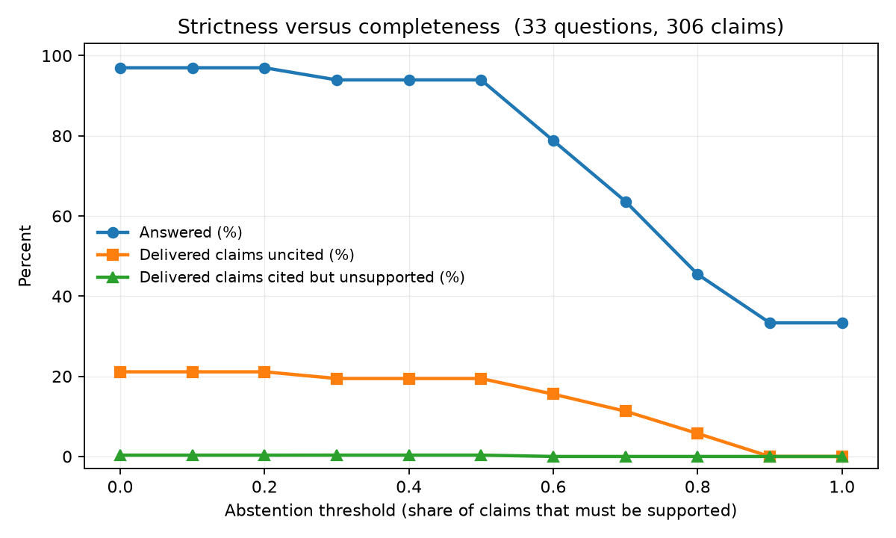

# anchor

Retrieval-augmented generation over vLLM and LLM-serving documentation, with a
**grounding verification layer**: every claim in a generated answer is traced to
a retrieved source span, and claims of a verifiable class (CLI flags, API
symbols, config keys) are checked against the **actual vLLM source code** rather
than against the retrieved text alone.

The deliverable is not the chatbot. It is a measured tradeoff curve between
grounding strictness and answer completeness.

**Why this corpus.** Technical documentation gives an objective oracle.
`--max-num-seqs` either exists in vLLM's CLI or it does not. That makes a subset
of the faithfulness checks ground-truthed instead of LLM-judged, which is
unusual for a RAG evaluation project. A second property falls out of the same
choice: vLLM releases fast and its docs go stale, so chunks are version-tagged
and the system can flag retrieved guidance that describes outdated behaviour.

> **Status: phase 1 complete.** Every number below was measured by the harness
> in this repository and can be reproduced from the commands in Quickstart. Two
> steps are deliberately left un-triggered because they publish under a personal
> account: the Hugging Face Spaces deployment and the vLLM documentation pull
> request, drafted in [`contrib/vllm-docs-pr/`](contrib/vllm-docs-pr/).

---

## Results

### Chunking: code-block integrity

Measured, not judged. For every fenced code block in the corpus, does some chunk
under this strategy contain that block's body verbatim? A block split across two
chunks fails, because neither half is a command anyone can run.

Corpus: vLLM v0.28.1rc0 at commit `65f3fca5`, 1722 documents, 6245 code blocks.
(Document count later rose to 1729 once attribute docstrings were captured; the
integrity numbers below predate that and are unaffected by it, since it added
no code blocks.)

| Chunking | Code blocks intact | Rate |
|---|---|---|
| `fixed` (512 tokens, 64 overlap) | 6095 / 6245 | 97.6% |
| `structure_aware` | 6245 / 6245 | 100% |

The aggregate rate is the least interesting cut of this, and on its own it is
misleading. A 512-token window only breaks a block long enough to straddle a
window boundary, and most blocks in these docs are one-line invocations. Split
by block length, the effect is stark:

| Block size (tokens) | Blocks | `fixed` intact | `structure_aware` intact |
|---|---|---|---|
| ≤ 32 | 3161 | 100% | 100% |
| 33 to 64 | 1744 | 100% | 100% |
| 65 to 128 | 966 | 95% | 100% |
| 129 to 256 | 316 | 79% | 100% |
| > 256 | 58 | **31%** | 100% |

So the honest finding is narrower and more useful than "fixed-size chunking
mangles code blocks". It mangles the *long* ones: the multi-line configs and
full serve invocations, which are exactly the blocks a user wants to copy whole
and the ones a short snippet cannot substitute for. Short blocks are unaffected,
and any evaluation reporting only the aggregate would have missed this.

Why the boundary behaves that way: with a 512-token window and 64-token overlap
the stride is 448, so a block starting at offset `a` survives only if its length
fits in `512 - (a mod 448)`. Worst-case alignment leaves 65 tokens. Every block
above that is at the mercy of where it happens to land.

**Caveat, measured:** 11 of 6245 blocks (0.18%) exceed the encoder's 512-token
input limit, the largest at 913 tokens. Structure-aware chunking keeps those
whole in storage, but bge-small still truncates them at embed time, so "intact"
means retrievable as text, not fully embedded.

### Corpus: where vLLM's documentation actually lives

Building retrieval over this corpus surfaced something worth recording, because
it changes what "ingest the docs" has to mean.

vLLM's engine arguments and config keys are documented almost entirely as
**attribute docstrings**: a bare string expression following a field
assignment.

```python
max_num_seqs: int = Field(default=DEFAULT_MAX_NUM_SEQS, ge=1)
"""Maximum number of sequences to be processed in a single iteration."""
```

Python's `ast.get_docstring` cannot see these, because they belong to no
function or class. An ingester that walks docstrings the obvious way silently
drops every one. In `vllm/config/` alone that is **532 field descriptions**.

It compounds: the rendered engine-arguments page is generated from those fields
at docs build time and is not committed. The source tree holds only a stub
ending in an mkdocs include directive, and 29 doc pages are stubs of that shape.
So the authoritative description of every engine flag is absent from both the
docs sources *and* a naive docstring pass.

Measured effect on the query "what does max_num_seqs do and what is its
default":

| | Before | After |
|---|---|---|
| Chunks mentioning `max_num_seqs` | 12 | 18 |
| Top reranked span | wrong document | `SchedulerConfig.max_num_seqs`, score 0.99 |

This is also the clearest argument yet for the symbol oracle in week 2. The
ground truth for flags and config keys is in the source tree, not the prose.

### Retrieval: an open weakness, to be quantified

On a natural-language phrasing of the same question, "how do I limit the number
of concurrent sequences the server handles", the pipeline does **not** surface
that chunk. Its cosine similarity is 0.654 against a corpus best of 0.709, and
78 chunks outrank it. Raising the candidate pool to 200 does not rescue it: the
cross-encoder scores every candidate below 0.11, so it is not confident in any
of them.

The cause is a vocabulary gap between how a user asks and how the docs are
written. Recording it rather than tuning it away: `dense_top_k` and the
reranking knobs are experiment variables, and the golden set is what decides
them. The golden questions come from real GitHub issues, so this gap is exactly
the distribution they will test.

### The golden set

60 to 80 questions, every one filed by a real person on vLLM's issue tracker.
Nothing is synthesised, and that is the point: a model-generated set is written
in the vocabulary of the documentation it was generated from, so it flatters
retrieval and measures the wrong thing.

Built by harvesting issues labelled `usage` and `documentation`, sorted by
reaction count, then curating against retrieval evidence rather than titles.

| | |
|---|---|
| Candidates harvested | 563 |
| Curated so far | 52 |
| Target | 60-80 |

Two curation rules are worth stating, because they are what stop the set
measuring the wrong thing:

- **Questions the system currently fails are kept.** A set built only from what
  retrieval already finds is a transcript of current behaviour and cannot
  measure anything. "How to disable logging" is in the set precisely because the
  pipeline gets it wrong today.
- **Questions no documentation can answer are dropped, not marked hard.**
  "Can I get the loss of model directly?" was rejected on that basis, as was a
  Whisper-timestamps question whose only match is a code sample about
  implementing a model. Keeping them would make retrieval look broken when the
  corpus, not the retriever, is the limit.
- **A rejection can itself be wrong, so rejections get re-checked.** A
  sparse-embeddings question was dropped in the first pass and reinstated once
  `specific_models.md` turned out to document it, serve command included.

Entries store expected *document paths*, not chunk ids: chunk ids are stable
only within one (strategy, commit) pair, so pinning them in a version-controlled
file would rot on the next re-chunk.

### Generation: cost and citation behaviour

Answers are generated with `claude-opus-5` over the top spans from the best
retrieval configuration, and every claim must cite the span number it came from.
Measured over the full golden set, run 5:

| | |
|---|---|
| Answers | 33 |
| Cost per answer | **$0.0280** |
| Total cost | $0.9251 |
| Mean latency | 8.4 s |
| Mean input / output tokens | 2284 / 665 |
| Spans supplied that were cited | 127 / 165 (77%) |
| Answers citing a span that did not exist | 0 |
| Answers citing nothing at all | 0 |

Cost per request is a question that gets asked directly, so it is measured
rather than estimated. Abstained rows store NULL usage rather than zeros, so an
abstention can never be averaged in as a free, instant answer.

**23% of supplied spans are never cited.** That is a retrieval signal, not a
generation fault: `rerank_top_n` is 5, and answers typically use fewer, so the
surplus is paid for in input tokens on every single query. It is a config knob,
so the sweep decides it, not a hand-tuned guess.

**A bug worth recording, because it would have become a false headline.** The
first run reported that 4 of 33 answers cited a span that was never supplied,
which reads as a checkable hallucination. Every one was the citation parser
mistaking bracketed integers in code for citations:

```
output.outputs[0].text
cudagraph_capture_sizes=[1, 2, 4, 8, 16]
```

Both are real fragments from generated answers. Citations are only meaningful in
prose, so fenced blocks and inline code spans are now stripped before parsing.
After the fix the true count is zero, and the eight test cases guarding it are
taken verbatim from those answers. Publishing the unfixed number would have
been a hallucination claim about the model that was really a bug in the
measurement.

### The symbol oracle

The reason a subset of faithfulness checks here are ground-truthed rather than
LLM-judged. `--max-num-seqs` either exists in vLLM's argument parser at a pinned
commit or it does not, and no judge's opinion changes that.

Symbols are recovered by walking the AST of the pinned checkout, never by
importing vLLM or running `--help`: both need the package installed with CUDA,
and the oracle has to run in CI.

| Kind | Symbols |
|---|---|
| CLI flags | 433 |
| Config keys | 3603 |
| Classes | 5366 |
| Functions | 3967 |
| **Total** | **13369** |

Built from 2392 files at v0.28.1rc0. Verified: real flags resolve, and an
invented `--enable-turbo-mode` in a serve command is returned as
`contradicted`, not merely unsupported, because the source says otherwise.

**vLLM declares its command line two ways, and missing one produced false
accusations.** Most flags are string literals in `add_argument`. The rest are
generated in a loop with no literal anywhere:

```python
frontend_kwargs = get_kwargs(cls)
for key, value in frontend_kwargs.items():
    group.add_argument(*extra, f"--{key.replace('_', '-')}", **value)
```

A literals-only oracle reported `--tool-call-parser`, `--chat-template` and
`--enable-auto-tool-choice` as non-existent. All three are real. The second
mechanism is now detected structurally, by finding functions that both call
`get_kwargs` and pass an f-string to `add_argument`, and fields are inherited
through base classes because a subclass inherits its parent's flags.

**Jurisdiction is narrow, on purpose.** The first version judged every `--flag`
and every backticked identifier in an answer. Across 33 real answers that
produced 106 checkable mentions with a 42% "not found" rate, and almost none
were hallucinations:

| What it actually was | Example |
|---|---|
| Another tool's flag, used correctly | `pip install --editable`, `numactl --cpunodebind` |
| A config *value*, not a field name | `fp8_e5m2` is a value of `kv_cache_dtype` |
| A variable from the model's own example | `a_val`, `b_val`, `target_token` |
| Another library's API parameter | `max_new_tokens` is HuggingFace's |

An oracle that reports those as contradictions is worse than no oracle, because
its verdicts carry the authority of ground truth. So it now rules only on flags
appearing inside an actual vLLM invocation, and does not adjudicate config keys
at all: a backticked identifier is as likely to be a value, a local variable, or
another library's parameter, and the name alone cannot distinguish them.

After narrowing, the same 33 answers yield 7 adjudicable flag claims and **0
contradictions**. Every flag the answers attributed to vLLM is real.

The cost is recall, and that is the right way round. A hallucinated flag outside
a command line falls through to the LLM judge, which is the fallback the design
already has. A false contradiction has no such safety net.

### Retrieval: recall@k by chunking strategy and retrieval mode

Both chunking strategies are indexed at the same time and queried identically,
so the comparison is like-for-like. Recall is measured at the **document**
level: of the top k retrieved chunks, did any come from a document the golden
entry names? The two strategies cut the same document into different numbers of
pieces, so a chunk-level score would reward whichever produces more chunks
rather than whichever retrieves the right material.

| Chunking | Retrieval | recall@1 | recall@3 | recall@5 | recall@10 | recall@20 |
|---|---|---|---|---|---|---|
| `fixed` | dense | 0.21 | 0.53 | 0.67 | 0.76 | 0.82 |
| `fixed` | sparse | 0.17 | 0.23 | 0.23 | 0.23 | 0.25 |
| `fixed` | hybrid (RRF) | 0.32 | 0.60 | 0.74 | 0.81 | 0.85 |
| `fixed` | hybrid (RRF) + rerank | 0.42 | 0.68 | 0.77 | 0.84 | 0.85 |
| `structure_aware` | dense | 0.48 | 0.64 | 0.71 | 0.78 | 0.92 |
| `structure_aware` | sparse | 0.19 | 0.23 | 0.23 | 0.23 | 0.25 |
| `structure_aware` | hybrid (RRF) | 0.54 | 0.72 | 0.76 | 0.83 | 0.96 |
| `structure_aware` | **hybrid (RRF) + rerank** | **0.55** | **0.90** | **0.92** | **0.95** | **0.96** |

Run 6, commit `aaf9399`, **52 golden questions**. Reproduce with
`uv run anchor eval-retrieval`.

Every cell runs the same questions, so the paired record is the honest
comparison and a two-sided exact sign test is the appropriate check. It assumes
only that a question separating the two configurations is a coin flip under the
null, which is the least this comparison can assume.

| k | `structure_aware` better | `fixed` better | same | sign test |
|---|---|---|---|---|
| 1 | 13 | 3 | 36 | p = 0.0213 |
| 3 | **15** | **0** | 37 | **p = 0.0001** |
| 5 | 11 | 0 | 41 | p = 0.0010 |
| 10 | 8 | 0 | 44 | p = 0.0078 |
| 20 | 8 | 0 | 44 | p = 0.0078 |

**Structure-aware chunking wins 15 questions and loses none at k=3.** The
direction never reverses at any depth. Growing the set from 33 to 52 questions
strengthened it rather than washing it out, which is what a real effect does.
It is still one eval set on one corpus, so it is evidence about vLLM's
documentation rather than a general claim about chunking.

What the table supports:

- **Sparse alone is weak here, at 0.27 recall@20.** Not a bug. These are
  natural-language issue titles that share almost no vocabulary with the docs,
  and keyword search cannot match "concurrent sequences" to `max_num_seqs`. It
  earns its place inside the hybrid, not on its own.
- **Reranking helps structure-aware far more than fixed**, lifting recall@3 from
  0.67 to 0.89 against 0.55 to 0.64. A cross-encoder scores a query against a
  passage, and a fixed-size window that starts and ends mid-sentence is a worse
  passage to score. Chunking and reranking are not independent choices, which is
  not visible from either row alone.
- **Still only two questions are never retrieved by any configuration**, the
  same two, after adding 19 more. Both were flagged as expected failures during
  curation, before the harness existed:
  `vllm-6660-disable-logging`, whose answer lives only in `vllm/envs.py` because
  the env-var page is an mkdocs stub, and
  `vllm-23108-gpt-oss-builtin-python-tool`.
- **The absolute numbers fell when the set grew from 21 to 33.** `fixed` at
  recall@1 went 0.45 to 0.35. The second curation batch added harder questions,
  so the set got harder rather than the system getting worse. This is the
  expected direction while a golden set is still being built, and it is the
  reason the run id and commit are printed next to every table.

### Grounding: strictness versus completeness



The headline result. Sweeping the abstention threshold trades how often the
system answers at all against how well-grounded the answers it does give are.
Over 52 golden questions and 496 extracted claims:

| Abstention threshold | Answered | Abstained | Answer rate | Delivered claims | Cited but unsupported | Uncited |
|---|---|---|---|---|---|---|
| 0.00 | 52 | 0 | 100% | 496 | 1 (0%) | 107 (22%) |
| 0.30 | 50 | 2 | 96% | 481 | 1 (0%) | 100 (21%) |
| 0.50 | 49 | 3 | 94% | 476 | 1 (0%) | 98 (21%) |
| 0.60 | 43 | 9 | 83% | 416 | 0 (0%) | 74 (18%) |
| 0.70 | 35 | 17 | 67% | 323 | 0 (0%) | 48 (15%) |
| 0.80 | 18 | 34 | 35% | 148 | 0 (0%) | 11 (7%) |
| 0.90 | 10 | 42 | 19% | 77 | 0 (0%) | 1 (1%) |
| 1.00 | 9 | 43 | 17% | 63 | 0 (0%) | 0 (0%) |

Run 9, 52 questions, 496 claims. Reproduce with `uv run anchor ground`. The
sweep calls no model: claims are scored once and re-thresholded, so the whole
curve costs one pass over answers already paid for.

**One claim in 496 cited a span that does not support it.** The shape held when
the set grew from 33 to 52 questions and the claim count from 306 to 496, which
is the useful thing about re-running it: the strict faithfulness failure rate
did not move.

**The two failure columns are separate on purpose, and merging them produced a
number four times too large.** A claim that cites a span which does not support
it asserted something its own evidence contradicts. A claim that cites nothing
is merely unattributable. The first version of this table folded both into one
"unsupported" figure and reported **37%**. Split apart:

| | Claims (52 questions) |
|---|---|
| Supported by their cited span | 323 |
| Cited a span that does not support them | **1** |
| Cited nothing at all | 172 |

The strict faithfulness failure rate is 1 claim in 496.

Two counts in this section differ and both are correct. The `claims` table
records 172 claims citing nothing; the tradeoff table's "uncited" column shows
107 at threshold 0. The difference is the 65 sentences that talk about the
evidence rather than about vLLM, which are excluded from the faithfulness
denominator but still stored, because a claim that was judged has to be
inspectable afterwards. The 37% was almost
entirely claims with no citation, which is a different and much less alarming
problem, and publishing it as a hallucination rate would have been wrong.

**Honest hedging is not a hallucination.** Many uncited sentences were the model
correctly declining: "The provided spans don't cover S3 credential
configuration", "I'd need documentation covering sparse embeddings to answer
this". Those assert nothing about vLLM. Counting them as unsupported claims
scores the exact behaviour the abstention policy exists to encourage, and would
push the system toward confident guessing. They are now detected and excluded
from the faithfulness denominator, which moved the uncited rate from 23% to 21%
and, more importantly, stopped penalising the right answer.

**What the curve shows.** Raising the threshold from 0.00 to 0.90 cuts the
answer rate from 97% to 33% and drives uncited claims from 21% to zero. The
knee is around 0.60 to 0.70, where the system still answers 64% to 79% of
questions while more than halving the uncited rate. There is no threshold at
which strictly unsupported claims are a problem, because there was only ever one.

**How the columns are computed.** The curve thresholds on span attribution,
which is free, so the whole sweep is a re-thresholding of one pass. The LLM
judge scores the same claims independently and agrees on 98% of them; see
verifier agreement below. The symbol oracle covers the checkable subset exactly
and found no contradictions across the 3 answers it had jurisdiction over.

### The RAG triad

| Metric | Score | Notes |
|---|---|---|
| Faithfulness | see grounding above | measured against cited spans, plus the symbol oracle |
| Answer relevance | **0.98** | almost every answer addressed its question |
| Context relevance | **0.59** | share of retrieved spans that were actually useful |

52 answers, run 9, $1.36. Fully relevant context on only 7 of 52 questions.

**Answer relevance is 1.00 because honest non-answers count as relevant.** An
answer correctly reporting that the documentation does not cover something has
addressed the question. Scoring that as irrelevant would reward guessing, which
is the opposite of what the abstention policy is for, so the rubric says so
explicitly.

**Context relevance of 0.59 is the actionable number, and it corroborates an
earlier finding by a different route.** Generation showed 22% of supplied spans
were never cited. The triad, judging span usefulness independently and without
seeing which were cited, puts 41% of spans as not useful. Two unrelated
measurements agreeing that `rerank_top_n` of 5 is larger than answers need is
much stronger evidence than either alone. Every surplus span is paid for in
input tokens on every query.

**On ragas, and why the two disagree.** The triad above is computed in
[`triad.py`](src/anchor/evaluate/triad.py) rather than by ragas, because ragas
requires LangChain, which was out of bounds when it was written. LangChain was
later permitted, so ragas is wired up as a *cross-check* rather than a
replacement: an in-house metric nobody has calibrated is a number without a
reference class. `uv run anchor ragas` drives it with Claude rather than OpenAI,
so a disagreement is about the metric and not about which model judged.

The comparison is **partial**: ragas exhausted the API budget after 15 of 33
samples on run 5, and again after ~17 of 52 on run 9. What it did produce is
worth reporting, because the two metrics disagree sharply and the reason is
instructive.

| Metric | This repo | ragas | Same thing? |
|---|---|---|---|
| Faithfulness | 1 unsupported claim in 496 | 0.94 | roughly agrees |
| Answer relevance | 0.98 | **0.57** | **no** |
| Context | 0.59 (relevance) | 0.88 (precision) | **no** |

The answer-relevance gap is not noise, it is a definitional difference. This
repo's rubric says explicitly that an honest "the documentation does not cover
this" is relevant, because it answered the question and penalising it would
reward guessing. Ragas's `AnswerRelevancy` generates questions from the answer
and measures their similarity to the original; a non-answer generates nothing
resembling the question and scores near zero. Both metrics are internally
consistent. They measure different things and share a name.

Context relevance and context precision differ the same way: one is the share of
retrieved spans that were useful, the other is a rank-weighted precision. The
lesson is not that one is wrong, it is that quoting a framework's number without
its definition is how a results table ends up meaning nothing.

**Ragas is roughly 5x more expensive per sample.** The triad cost $1.36 for 52
answers, about $0.026 each. Ragas consumed the remaining ~$2.22 across roughly
17 samples, about $0.13 each. That figure is inferred from the budget rather
than metered per call, so treat it as an order of magnitude, not a measurement.
The cause is structural: `AnswerRelevancy` alone makes several generation calls
per sample, where the triad scores answer relevance and every span in one.

### Verifier agreement

Three verifiers, deliberately ordered cheapest-first. The symbol oracle is exact
and free but only covers checkable names. Span attribution is cheap but measures
similarity, which is a proxy for support. The LLM judge reads the span and the
claim together and is the only one that can catch a claim sitting close to its
span while stating something different.

Over 306 claims from 33 answers, run 5:

| Verifier | Claims judged | Cost | Result |
|---|---|---|---|
| Symbol oracle | 3 answers in jurisdiction | free | 0 contradictions |
| Span attribution | 306 | free | 193 supported |
| LLM judge | 306 | $1.30 | 194 supported, 31 unsupported, 81 unverifiable |

**The two agree on 301 of 306 claims (98%)** on the binary question of whether a
claim is supported. The judge was stricter on 2, similarity on 3. That number is
the phase 2 argument in miniature: a free check already reproduces a $1.30 one
almost everywhere, and the interesting question is whether the remaining 2%
matters.

**No claim cited a span that failed to support it.** Both verifiers agree, and
this is the strongest single result in the grounding layer: across 306 claims,
zero cases of the answer pointing at evidence that does not say what it claims.
Every one of the judge's 31 `unsupported` verdicts is on a claim that carried no
citation at all.

What the judge adds is a distinction similarity cannot make. It splits the 112
uncited claims into 31 genuine assertions that should have carried a citation
and 81 that are not factual assertions about vLLM at all, mostly the model
noting the limits of its own evidence.

**Verified on a constructed case, because the real answers contain none.** Given
a span reading "Default 128" and the claim "max_num_seqs defaults to 512", the
judge returns `contradicted` with the reason "The span states the default is 128,
not 512". Cosine similarity between those two is high, since they differ by one
token. This is the failure mode the judge exists for, and the reason the
cited-but-unsupported column is a semantic verdict rather than a similarity
floor.

---

## How it works

1. **Ingest.** Clone vLLM at a pinned commit. Parse the docs sources, the
   README, and public docstrings. Record version and commit on every document.
2. **Chunk.** Two strategies, both persisted:
   - `fixed`, roughly 512 tokens with 64 overlap, the naive baseline
   - `structure_aware`, split on heading boundaries, never splitting a fenced
     code block
3. **Index.** Embed with `bge-small-en-v1.5`, write to pgvector with an HNSW
   index, and build the `tsvector` in the same row.
4. **Retrieve.** Dense top-k and sparse top-k, fused with Reciprocal Rank
   Fusion, then reranked with a `bge-reranker-base` cross-encoder.
5. **Generate.** Assemble a prompt of numbered context spans and require inline
   citation of the span IDs.
6. **Ground.** Extract atomic claims, attribute each to a span, route verifiable
   claims to the symbol oracle and the rest to span attribution plus an LLM
   judge, then apply the abstention policy.
7. **Evaluate.** Run the golden set across configs, log to Weights & Biases, and
   write the tables above.

Token counts use the embedding model's own tokenizer rather than a generic one,
because the binding constraint is that encoder's 512-token input limit.

### Design decisions worth asking about

- **One datastore for dense and sparse.** Postgres with pgvector holds the
  embeddings and the full-text index in the same row, so hybrid retrieval is a
  single SQL statement and there is no second service to keep in sync.
- **RRF over weighted score fusion.** Rank fusion needs no score normalisation
  between a cosine similarity and a BM25 score, and no tuned weights to justify.
- **Cosine distance.** Embeddings are L2-normalised at write time.
- **`cost_usd` and `latency_ms` recorded from the first run.** Per-request cost
  is a question that gets asked, and the answer should be measured.
- **An unknown price stores as NULL, never 0.** Missing has to look missing.

---

## Quickstart

Requires Docker and [uv](https://docs.astral.sh/uv/).

```bash
cp .env.example .env      # then fill in ANTHROPIC_API_KEY
uv sync --all-extras
docker compose up -d db   # Postgres 16 + pgvector on host port 5433
uv run anchor db init     # idempotent
uv run anchor db check    # row counts per table
uv run anchor config      # the exact JSON written to runs.config_json

uv run anchor ingest      # clone vLLM at a pinned commit, parse, version-tag
uv run anchor chunk       # build both chunking strategies over the corpus
uv run anchor index       # embed into pgvector and build the tsvectors
uv run anchor integrity   # the code-block integrity table above

uv run anchor search "what does max_num_seqs do and what is its default"

uv run anchor golden harvest    # candidate questions from real vLLM issues (needs gh)
uv run anchor golden propose    # retrieval evidence for each, for human review
uv run anchor golden validate   # every expected document exists in the corpus

uv run anchor eval-retrieval    # the recall@k sweep; writes a row to `runs`

uv run anchor ask "what does max_num_seqs do"   # one cited answer
uv run anchor golden sync                       # golden set into Postgres
uv run anchor answer-golden --yes               # answer the whole set; costs money
uv run anchor oracle-build                      # populate the symbol oracle
```

Re-running `ingest` stays on the commit already ingested. Advancing to the
branch tip is explicit (`--latest`), because it orphans every chunk and
embedding built against the previous commit.

Every stage after `ingest` pins itself to the commit the corpus was ingested at,
read back from the database. vLLM's main branch moves several times a day, so a
stage that re-resolved the branch tip would check out a tree that no longer
matches the `documents` rows.

Serve it:

```bash
docker compose --profile app up      # API on :8080, demo on :7860
# or locally
uv run uvicorn anchor.api.app:app --port 8080
uv run python -m anchor.demo.app     # Gradio on :7860
```

`POST /ask` returns the answer *and* its evidence: which spans were retrieved,
which of them the answer cited, how many claims their spans support, and why an
answer was withheld when it was. `GET /health` reports corpus counts rather than
process liveness, because a server answering against an empty index is up and
useless.

Run the checks the way CI does:

```bash
uv run ruff check . && uv run ruff format --check .
uv run mypy src tests
uv run pytest
```

## Configuration

Every tunable value lives in [`src/anchor/config.py`](src/anchor/config.py).
Nothing downstream inlines a magic number, because each knob is a potential
sweep dimension and each sweep dimension has to be recorded alongside its
results. Override through the environment with an `ANCHOR_` prefix and a double
underscore for nesting:

```bash
ANCHOR_RETRIEVE__DENSE_TOP_K=100 ANCHOR_CHUNK__STRATEGY=fixed uv run anchor config
```

Every eval run writes a row to `runs` holding that config and the git SHA, so a
table in this README can be traced back to the commit that produced it.

## Layout

| Path | What lives there |
|---|---|
| `src/anchor/config.py` | Every knob in the system |
| `src/anchor/schema.sql` | The data model, applied by compose and by the CLI |
| `src/anchor/ingest/` | Fetch vLLM docs, parse, version-tag |
| `src/anchor/chunk/` | The two chunking strategies |
| `src/anchor/index/` | Embedding and writes to pgvector |
| `src/anchor/retrieve/` | Dense, sparse, hybrid fusion, reranking |
| `src/anchor/generate/` | Prompt assembly, Claude and vLLM backends |
| `src/anchor/ground/` | Claim extraction, span attribution, symbol oracle |
| `src/anchor/evaluate/` | Golden set, ragas, judge, sweep runner |
| `data/golden/` | The golden set, version-controlled |

## Status

| Phase 1 | |
|---|---|
| Ingestion, version-tagged, 1729 documents | done |
| Both chunking strategies, compared | done |
| Hybrid retrieval, RRF, cross-encoder rerank | done |
| Golden set from real vLLM issues | 52 of a 60-80 target |
| Generation with inline citation | done |
| Symbol oracle, 13369 symbols | done |
| Claim extraction, span attribution, LLM judge | done |
| Tradeoff curve | done |
| Evals in CI | done, over a fixture corpus |
| FastAPI and Gradio demo | done |
| Hugging Face Spaces deployment | needs an account, not triggered |
| vLLM documentation PR | drafted, not filed |

Two things are honestly incomplete. The golden set is at 33 rather than 60 to
80, so every result on it is directional rather than tight; the paired chunking
comparison is significant anyway, but the tradeoff curve would move with more
questions. And CI evals run over a fixture corpus rather than the real one,
which proves the pipeline works end to end but not that recall on the full
corpus has held.

**Phase 2** distils the LLM judge into a LoRA-tuned local model. The case for it
is already measured: span attribution reproduces the judge on 98% of claims, and
`claims` holds the labelled rows to train on.

**Phase 3** serves the generator on k3s with a quantized model. Note the local
GPU is a 12 GB RTX 5070 Ti Laptop, so quantization is a requirement there rather
than an experiment.

Phase 2 distils the LLM judge into a LoRA-tuned local model and reports
agreement against cost. Phase 3 serves the generator on k3s with a quantized
model and reports sustained throughput and P99 latency.
